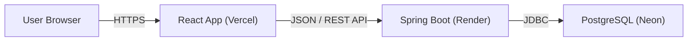

# 👨‍💻 Ayush's Full Stack Portfolio

> A modern, responsive portfolio website built with a **React** frontend and a robust **Spring Boot** backend. It features persistent data storage, smooth animations, and a fully cloud-native deployment architecture.

## 🚀 Live Demo

- **Frontend (Live Site):** [https://ayush-shah-portfolio-dev.vercel.app](https://ayush-shah-portfolio-dev.vercel.app)
- **Backend API:** Hosted on Render
- **Database:** Hosted on Neon (Serverless Postgres)

---

## 🏗️ Architecture

This project follows a decoupled **Client-Server** architecture:

1.  **Frontend (Client):** Built with React (Vite) and Framer Motion. It handles the UI, animations, and routing. Hosted on **Vercel**.
2.  **Backend (API):** Built with Java Spring Boot. It exposes REST endpoints (e.g., `/api/likes`) and handles business logic. Hosted on **Render**.
3.  **Database:** A PostgreSQL database that stores persistent data (like the "Like" count). Hosted on **Neon**.

---

## 🌟 Key Features

* **Dynamic "Like" System:** A real-time like counter that persists across sessions and users, stored in a PostgreSQL database.
* **Responsive Navbar:** A sleek, mobile-friendly navigation bar with "active pill" animations using `framer-motion`.
* **SPA Routing:** Seamless client-side routing using `react-router-dom` with 404 fallback handling for production.
* **Modern Styling:** Custom CSS with glassmorphism effects and responsive layouts.
* **Cloud Native:** Fully deployed on free-tier cloud services (Vercel, Render, Neon).

---

## 🛠️ Tech Stack

### Frontend (`/client`)
* **Framework:** React 18
* **Build Tool:** Vite
* **Styling:** CSS3 (Variables, Flexbox, Grid)
* **Animations:** Framer Motion
* **HTTP Client:** Axios
* **Routing:** React Router DOM

### Backend (`/server`)
* **Language:** Java 17+
* **Framework:** Spring Boot 3.x
* **Database:** PostgreSQL
* **Dependencies:** Spring Web, Spring Data JPA, Postgres Driver, Lombok
* **Build Tool:** Maven

---

## ☁️ Deployment Details

### 1. Database (Neon)
We use **Neon** for a serverless PostgreSQL instance. The connection string is provided to the Spring Boot application via environment variables.

### 2. Backend (Render)
The Spring Boot JAR is Dockerized (or built natively) on Render.
* **Environment Variables:** `DB_URL`, `DB_USERNAME`, `DB_PASSWORD` are injected securely.

### 3. Frontend (Vercel)
The React app is deployed on Vercel.
* **Rewrites:** A `vercel.json` file handles SPA routing (redirecting 404s to `index.html`).

> **⚠️ Note on "Cold Starts":**
> Since the backend is hosted on Render's **Free Tier**, the server spins down after 15 minutes of inactivity. The first request might take **30-50 seconds** to wake up. Subsequent requests are instant.
